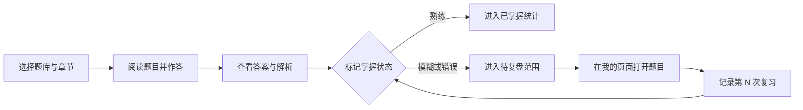
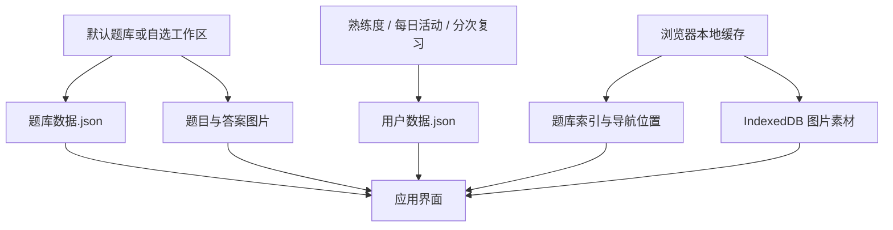

# 考研学习空间

本地优先的考研题库、错题复盘与学习进度工具。它把数学图片题库、2004–2026 年英语一真题、每日学习记录和多轮复习放在同一个界面中；无需注册账号，题库与学习数据默认保存在自己的电脑上。

当前默认内置 **10 个题库、4122 道题**。英语真题按“年份 → 题型”组织，数学图片题按“章节 → 小节 → 题号”组织；题库内容与个人学习记录分开存储，更新题库不会覆盖熟练度和复习历史。

> 当前版本：**v0.2.3** · 本地优先 · 无需注册 · 支持 macOS / Windows · 推荐 Chrome / Edge

## 快速导航

- [界面预览](#界面预览)：查看学习、看板和复习界面
- [开始使用](#启动)：一键启动或命令行启动
- [典型学习流程](#典型学习流程)：从选题库到多轮复习
- [核心功能](#核心功能)：完整能力总览
- [默认题库](#默认题库)：内置题库及题目数量
- [导入自己的题库](#导入格式)：JSON 与图片目录规范
- [数据保存](#数据说明)：题库、学习记录与备份位置
- [开发与验证](#开发与验证)：本地开发和测试命令

## 适合哪些场景

- **按教材刷题：** 用题库、章节、小节三级结构保持学习顺序，随时按状态筛题。
- **图片题整理：** 直接导入扫描题、讲义截图和多张解析图，不必逐题手工录入正文。
- **错题复盘：** 将模糊、错误题集中到复盘入口，掌握后自动退出当前错题列表。
- **长期进度跟踪：** 用日历查看每天做题量、正确率和待复盘数量，用多轮数据区分一刷、二刷。
- **离线与隐私优先：** 不需要账号或云数据库，适合保存个人购买资料和学习记录。

## 界面预览

### 题目学习

章节导航、题号状态、答案解析和熟练度标记集中在一个学习界面，上一题/下一题切换不会打断当前进度。


图中主要区域：

1. **左侧题库导航：** 切换题库、章节和小节，实时显示每节题量与题库掌握概览。
2. **中间题目卡片：** 保留原题排版，支持单图、多图、文字选项和独立答案解析。
3. **题目状态：** 用绿色、黄色、红色区分熟练、模糊和错误，再次点击当前状态即可撤销。
4. **右侧题号导航：** 一眼查看整节完成情况，点击题号直接跳转，并显示当前小节正确率。
5. **搜索与筛选：** 可以只看未标记、错误、模糊或熟练题，也能搜索当前小节内容。

### 学习看板

日历按天汇总练习数量、正确率与待复盘题目，并进一步展示题库、章节和小节进度。


学习看板不会只展示一个总百分比，而是从多个层级解释当前进度：

- 日历中的每一天显示练习题数与三种掌握状态的比例。
- 右侧摘要显示当天正确率、熟练/模糊/错误数量以及涉及题库。
- 指标卡汇总今日练习、今日正确率、今日待复盘和当前题库完成度。
- 题库详情继续下钻到章节和小节，方便定位“做得少”或“错误率高”的部分。
- 同一道题当天多次改选只计一次，以当天最后状态参与日历统计。

### 分次复习

题目弹窗区分“初始标记”和“第 N 次复习”，显示每次复习时间以及距初始标记、距上次复习的间隔。


复习侧栏与题目内容并排显示，查看解析后无需离开弹窗即可完成本次复习：

- “初始标记”保存第一次判断结果，不占用复习次数。
- 每张复习卡显示序号、结果、记录时间和两种时间间隔。
- 当前可操作卡片支持熟练、模糊、错误三种结果；再次点击已选结果即可取消。
- 当天最新记录允许调整，历史日期记录只读，避免误改既往轨迹。
- 默认预留 3 次复习；需要更多轮次时可以继续添加复习位。

## 典型学习流程



推荐用法：

1. 从“数学”或“英语”进入目标题库，选择当前计划学习的小节。
2. 做完题后再展开答案与解析，根据真实掌握程度选择熟练、模糊或错误。
3. 每天在“我的”页面查看日历和待复盘数量，优先处理错误题，再处理模糊题。
4. 从章节进度中点击题号打开复习弹窗，把复习结果记录到独立时间线。
5. 完成一轮后在设置中切换到下一学习轮次；旧轮次的标记和统计会完整保留。

## 启动

### 一键启动

- macOS：双击 `一键启动.command`（自动配置 Homebrew、Node.js、pnpm 和项目依赖）
- Windows：双击 `一键启动.bat`（通过 winget 自动配置 Node.js、pnpm 和项目依赖）

首次启动需要联网，macOS 安装 Homebrew 时可能要求输入系统密码。配置完成后会自动打开浏览器；以后双击通常可以直接启动。也可以使用命令行：

```bash
pnpm install
pnpm start
```

启动后可在终端输入 `R` 并回车重启服务，输入 `Q` 并回车安全关闭服务。开发时仍可使用 `pnpm dev` 直接运行 Vite。

生产构建：

```bash
pnpm build
pnpm preview
```

## 核心功能

| 模块 | 能力 |
| --- | --- |
| 题库学习 | 多题库、章节、小节切换；选择题、填空题、解答题和多图题展示；题号导航与上下题切换 |
| 掌握标记 | 熟练、模糊、错误三档标记；再次点击可取消；所有变化自动持久化 |
| 分次复习 | 初始标记与复习次数分开计数；记录复习时间和间隔；当天最新复习可修改或取消 |
| 学习看板 | 每日学习日历、正确率、待复盘数量、题库/章节/小节进度与掌握分布 |
| 错题复盘 | 跨题库汇总模糊与错误题；一键重练；掌握后自动移出当前复盘列表 |
| 搜索筛选 | 当前小节全文搜索；按未标记、熟练、模糊、错误筛选 |
| 图片题库 | 选择目录批量导入题目与答案图片；支持一题多图和重复导入覆盖 |
| 导出打印 | 按题库/章/节/状态筛选；每页 1 或 2 题；打印、另存 PDF、复制原图 |
| 数据管理 | 本地工作区同步、JSON 完整备份、多轮学习记录、题库与用户数据隔离 |
| 多端布局 | 桌面端完整双栏学习体验，平板与手机端自适应滚动和复习卡片布局 |

## 默认题库

| 分类 | 题库 | 题目数量 |
| --- | --- | ---: |
| 线性代数 | 880线代 | 311 |
| 线性代数 | 27基础30讲线代 | 169 |
| 高等数学 | 27基础30讲高数 | 419 |
| 数学二综合 | 27版1000题数二基础篇 | 407 |
| 数学二综合 | 27版1000题数二强化篇 | 452 |
| 线性代数 | Kira线代基础 | 165 |
| 高等数学 | 27张宇强化36讲高数 | 304 |
| 线性代数 | 27张宇强化36讲线代 | 87 |
| 高等数学 | 880高数 | 618 |
| 英语一 | 2004–2026 年英语一真题 | 1190 |
|  | **合计** | **4122** |

默认题库只是起点。可以继续新建空题库、导入 JSON，或把自己的题目/答案图片按命名规则放入独立目录批量导入。

## 复习规则

1. 第一次选择熟练度时生成“初始标记”，不计入复习次数。
2. 后续在复习卡片中选择状态，依次生成“第 1 次复习”“第 2 次复习”等记录。
3. 初始标记和第一次复习即使发生在同一天，也会作为两条独立记录保存。
4. 当天最后一次复习可以改选；再次点击已选状态可取消，取消后恢复到复习前的熟练度。
5. 默认展示 3 个复习位；超过 3 次可手动添加，额外添加且尚未使用的复习位可以删除。
6. 历史日期的复习记录只读，避免误改过去的学习轨迹。

## 导入格式

可以导入单纯的题库数组，或含 `banks` 字段的备份文件。最小格式：

```json
{
  "banks": [{
    "id": "my-bank",
    "name": "我的强化题库",
    "source": "local",
    "chapters": [{
      "id": "chapter-1",
      "name": "第一章",
      "sections": [{
        "id": "section-1",
        "name": "选择题",
        "questions": [{
          "id": "question-1",
          "number": 1,
          "type": "选择题",
          "text": "题目正文",
          "options": ["A. 选项一", "B. 选项二"],
          "answer": "A",
          "analysis": "解析正文"
        }]
      }]
    }]
  }]
}
```

题目还支持 `imageUrl`、`answerImageUrl`、`imageKeys`、`answerImageKeys` 和 `videoUrl`。导入同 ID 题库时，新数据会替换旧数据；学习状态会继续保留。

`type` 为可选字段：需要显示“选择题”“填空题”等标签时填写，不需要题型标注时可以直接省略。通过图片目录自动创建的题目默认不添加题型标签。

## 批量导入图片

点击顶部“图片”，选择一个包含图片的目录。系统严格按照统一文件名自动建立并匹配题目，可一次导入大量文件。Q/A 后依次为章号、小节号和题号：

```text
Q-01-1-01.png           单张题目图
Q-01-1-01.1.png         多图题目的第 1 张
Q-01-1-01.2.png         多图题目的第 2 张
A-01-1-01.png           单张答案图
A-01-1-01.1.png         多张答案中的第 1 张
A-01-1-01.2.png         多张答案中的第 2 张
```

如果图片放在 `01 行列式 1-基础` 普通文件夹中，还会自动把章节命名为“行列式”，小节命名为“基础”。点号后的分片序号没有固定上限。未按上述标准命名的文件会被安全跳过，再次导入同名文件会覆盖原图片。

## 数据说明

题库内容、个人学习记录和图片缓存采用分层保存，避免把数千张图片塞进浏览器的小容量文本存储：



- `题库数据.json` 只描述题库、章节、小节、题目和文件映射。
- `用户数据.json` 保存学习轮次、熟练度、每日活动、分次复习和考试日期等个人信息。
- 原始图片保留在题库目录；浏览器 IndexedDB 只在传统图片导入模式下缓存图片 Blob。
- “完整备份”适合迁移结构化数据；原始图片目录仍建议单独备份。

### 题库文件夹工作区（推荐）

使用最新版 Chrome 或 Edge，点击顶部“文件夹”，选择一个本地目录并授权读写。应用会扫描每个一级子文件夹作为一个题库。题库结构、重命名和目录映射写入 `题库数据.json`，学习标记、每日记录和用户设置单独写入 `用户数据.json`，项目数据与用户数据互不混合。

项目已经自带 [`默认题库`](./默认题库) 目录。一键启动后会自动连接并扫描该目录，无需手动选择或授予浏览器文件夹权限。只有切换到项目外的其他题库目录时，才需要在浏览器中进行一次授权。

```text
默认题库/
├── 题库数据.json
├── 880线代/
│   └── 01 行列式 1-基础/
│       ├── Q-01-1-01.1.png
│       └── Q-01-1-01.2.png
└── 英语一真题/
    ├── 2004年考研英语真题/
    ├── ...
    └── 2026年考研英语一真题/

用户数据/
└── 用户数据.json
```

- 一级子文件夹名称用于首次创建题库，后续以 `题库数据.json` 中的映射为准。
- 网页重命名会更新清单中的显示名称，不会强制重命名磁盘文件夹。
- 考试日期、当前学习轮次等用户设置保存在 `用户数据.json` 的 `settings` 字段；旧版浏览器设置会一次性迁移，成功后自动清理旧键。
- 学习标记和每日做题记录按轮次保存在 `用户数据.json` 的 `rounds` 字段；原有记录会自动归入第 1 轮，默认预设 5 轮，可在设置中继续新增。
- 将新图片复制进工作区后，点击顶部“已连接”重新扫描即可导入；网页内的重命名和题库修改写回题库清单，学习标记写回独立用户数据文件。
- 项目外的自选工作区会在同一根目录生成两个相互独立的文件：`题库数据.json` 与 `用户数据.json`。
- 旧版 `题库数据.json` 中的 `statuses` 字段仍可读取，连接后会迁移到新版用户数据并在后续写入中移除旧字段。
- 浏览器首次必须由用户选择并授权文件夹，这是浏览器的安全要求；授权记录会保存在当前浏览器中。
- Safari/Firefox 暂不支持目录写回时，仍可使用原有“图片”导入与 JSON 备份。

- 题库键：`npee:banks:v1`
- 学习轮次键：`npee:rounds:v1`（旧版状态与每日记录会合并迁移到第 1 轮，成功后删除旧键和空轮次）
- 用户设置键：`npee:settings:v1`
- 图片素材：浏览器 IndexedDB 数据库 `npee-question-assets`
- 点击设置中的“完整备份”可导出题库、全部学习轮次和用户设置。
- 图片不存进 `localStorage`，支持远高于普通 JSON 缓存的容量；实际配额由浏览器和磁盘空间决定。
- JSON 备份包含题库结构、各轮学习状态、各轮每日记录和用户设置，不包含 IndexedDB 中的图片 Blob。
- 清除浏览器站点数据会删除本地内容和图片，请保留原始图片目录并定期备份 JSON。

## 常见问题

### 为什么选择文件夹后不能写回？

文件夹实时同步依赖 File System Access API，请使用最新版 Chrome 或 Edge，并在浏览器提示时授予读写权限。Safari 和 Firefox 可以使用大部分学习功能，但不能完整写回目录。

### 新复制的图片为什么没有立即出现？

将图片复制到工作区后，点击顶部的“已连接”重新扫描。确认文件名符合 `Q-章-节-题号` 或 `A-章-节-题号` 规则，且扩展名为 PNG、JPG、WebP 等受支持格式。

### 取消熟练度会不会删除历史复习？

题目当前熟练度和复习时间线是两层数据。当日最新复习可以在复习卡片中取消并恢复复习前状态；历史日期记录保持只读。直接修改题目当前状态不会重写已有的历史复习卡片。

### 如何迁移到另一台电脑？

先在设置中导出“完整备份”，再复制原始题库图片目录。新电脑导入备份并重新连接图片工作区即可。仅复制 JSON 备份不会包含浏览器 IndexedDB 中缓存的图片 Blob。

### 可以清除浏览器缓存吗？

可以，但清除站点数据前应先导出完整备份，并确认原始图片目录仍然存在。浏览器缓存被清除后，未写回文件的学习数据和缓存图片无法自动恢复。

## 浏览器兼容性

- **推荐：Chrome / Edge 最新版。** 支持目录选择、题库文件写回和默认工作区自动同步。
- Safari / Firefox 可以学习、标记、导入 JSON 和使用浏览器本地缓存，但不能完整使用文件夹实时写回。
- 手机浏览器适合查看题目、标记与复习；批量图片导入和工作区维护建议在桌面端完成。

## 项目结构

```text
NPEElearningtool/
├── src/                  React 界面、状态管理和测试
├── scripts/              一键启动与默认工作区服务
├── docs/screenshots/     README 界面截图
├── 默认题库/             题库清单与原始图片
├── 用户数据/             用户数据格式说明与本地数据文件
├── 一键启动.command      macOS 启动入口
└── 一键启动.bat          Windows 启动入口
```

## 开发与验证

```bash
pnpm install      # 安装依赖
pnpm dev          # 启动开发服务器
pnpm test         # 运行全部单元测试
pnpm build        # 类型检查并生成生产构建
pnpm preview      # 本地预览生产构建
```

发布前建议至少运行 `pnpm test` 与 `pnpm build`，并在桌面和手机宽度下检查题目学习、答案展开、熟练度撤销、学习看板和复习弹窗。
